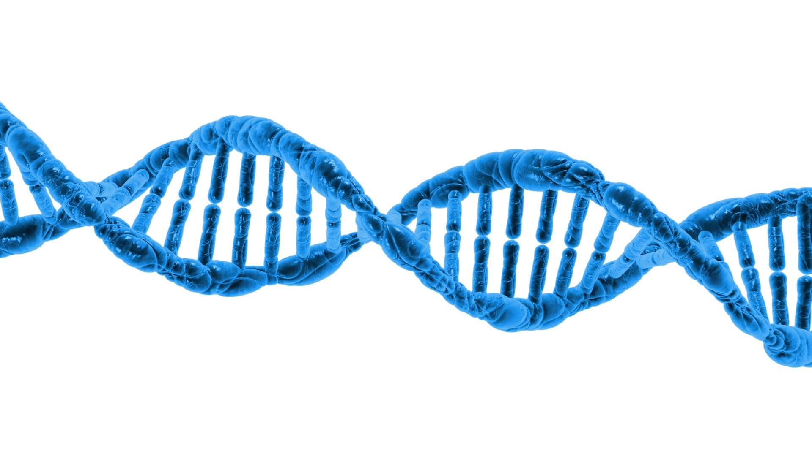

# Bioinformatics 2023-2024 - Practice

This repository contains the material for the practical part of the course Bioinformatics - academic year 2023-2024 (Department of Computer Science, University of Milan).
All the lessons are prepared using R Notebooks, which are R markdown documents having blocks of code that can be executed.
For more information about R Notebooks: [read this](https://bookdown.org/yihui/rmarkdown/notebook.html).

To use notebooks, it is necessary to have installed R and Rstudio. All code was tested using R version 4.2.3 (2023-03-15) -- "Shortstop Beagle".
Once the installation is performed, you can open notebooks using Rstudio. Both R markdown files (.Rmd) and html notebook (.nb.html) can run code in Rstudio, 
however html notebooks can be also viewed on your browser.

At the beginning of each notebook there is the code to install required packages from [CRAN](https://cran.r-project.org/) and [Bioconductor](https://www.bioconductor.org/).

If you have any problem with this code you can open a github issue or, in case of students of the course, you can drop me a message to my university e-mail.

| Date          | Time         | Topic                                                                                |
| ------------- | ------------ |--------------------------------------------------------------------------------------| 
| 14/11/2023    | 13.30-15.30  | - Semi-supervised classification using graph-based algorithms on gene expression data|
| 16/11/2023    | 10.30-12.30  | - Disease subtype discovery on multi-omics data                                      |
| 21/11/2023    | 13.30-15.30  | - Description of the exam project                                                    |
|               |              | - Start to work on project or presentation for exam                                  |

:school: **Place**: All lessons will be held in Aula BETA (Dept. of Computer Science, 
Via Celoria, 18, Milano, 20133) or Aula L (Dept. of Physics, Via Celoria, 16, Milano, 20133).
You can consult the [timetables online](https://easystaff.divsi.unimi.it/PortaleStudenti/index.php?view=easycourse&_lang=en).

:movie_camera: **Recording of lessons**: lessons will not be recorded, but the R notebooks of the [first](https://github.com/GliozzoJ/Bioinformatics_practice_2023-2024/blob/main/practice1_SSL.Rmd) and [second](https://github.com/GliozzoJ/Bioinformatics_practice_2023-2024/blob/main/practice2_clustering.Rmd) lessons contain both executable code and theory about the considered topics. 
If you need to skip a lesson, you can find all the material in the notebooks and you can ask questions during the next lesson (if something is not clear :grimacing: ).

:bar_chart: **Final Exam**: information about the project exam are available in the PDF file "exam_information.pdf" present in this repository ([link here](https://github.com/GliozzoJ/Bioinformatics_practice_2023-2024/blob/main/exam_information.pdf)).

:mailbox: **Contacts**: Students can contact me using my University e-mail (jessica.gliozzo@unimi.it).
