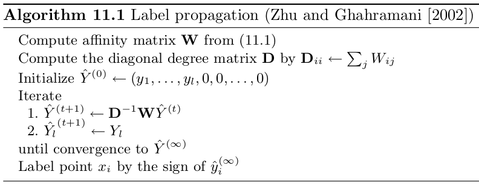

In this lesson, we will explore the application of different semi-supervised 
algorithms (i.e. P-Net @gliozzo2020pnet, label propagation @zhu2002label.prop and 
guilt-by-association @oliver2000GBA) that work
on graphs to predict if a patient has Acute Myeloid Leukemia (AML) or 
Acute Lymphoblastic Leukemia (ALL) from gene expression data.

# Install and load packages

First of all, we need to install all the packages needed for this lesson (it will
take a while):

```{r message=FALSE, warning=FALSE}
if (!require("BiocManager", quietly = TRUE))
    install.packages("BiocManager")

BiocManager::install("golubEsets");
BiocManager::install("hu6800.db");
BiocManager::install("annotate");
BiocManager::install("genefilter");
BiocManager::install("limma");
BiocManager::install("RBGL");
install.packages("PerfMeas");
install.packages("RANKS");
install.packages("SNFtool");
install.packages("caret");
install.packages("ROCR");
```

Now we can load all the packages:
```{r message=FALSE, warning=FALSE}
library("golubEsets");
library("genefilter");
library("hu6800.db");
library("annotate");
library("RANKS");
library("caret");
library("ROCR");
library("SNFtool");
```

# Leukemia gene expression dataset

We will use a famous dataset available for R, called "Golub dataset", from the 
name of the first author of the corresponding study @golub1999molecular. 
The dataset is composed of 72 samples/patients having Leukemia and described
by their gene expression profiles (i.e. the level of mRNA expression for each patient).
The task is to predict their type of leukemia: Acute Lymphoblastic Leukemia (ALL) or 
Acute Myeloid Leukemia (AML). 

The following code is used to load the dataset from the package "golubEsets":

```{r message=TRUE}
# Load data:
data(Golub_Merge);

# Print summary of the eSet object:
Golub_Merge;
```

As we can see, the data are stored in an object of class "ExpressionSet" @falcon2007introduction. An ExpressionSet is a data structure commonly used 
to represent genomic data, which allows to store and manipulate many different 
sources of information. 
In particular, the following information are usually present: 

- expression data often from microarray technology (we'll briefly see in the 
next section what are microarrays) - **AssayData**. Opposite to what we see
in machine learning and data analysis applications, the expression matrix has
features in the rows and samples in the columns (note that this is quite
common in genomic datasets).
- data describing the considered samples (e.g. age, sex, clinical
condition, etc.) - **phenoData**. We have the same number of rows in this
matrix and columns in the expression data (i.e. the number of samples
has to match). Also the names of the samples has to be the same. A 
**varMetadata** can be present to explain the meaning of the 
different columns.
- metadata related to features are also important - **Annotation**. 
Since they are related to the used high-throughput technology (i.e. which microarray was used to perform the experiment), specific packages containing information on the different technologies are present on Bioconductor.
We will see later how they are important to annotate each microarray probe. 
In practice, annotation contains just a string with the name of the 
microarray chip used for the experiment, and we need this to install
the corresponding annotation package.
- information about th experiment are available under 
**experimentData**.

In the following chunk of code, we will access the main different information
we have in the Golub dataset:

```{r message=TRUE}
# Access expression matrix:
expr <- exprs(Golub_Merge);
as.data.frame(expr[1:5, 1:5]);

# Access phenotypic data:
pheno <- pData(Golub_Merge);
pheno[1:5, 1:5];

# Access metadata related to phenotypic variables (i.e. variables description):
varMetadata(Golub_Merge);

# Access the annotation data
message("The used chip is: ", annotation(Golub_Merge), "\n");

# Access the experiment data:
experimentData(Golub_Merge);
```

## What is a microarray?
<center>
)](./images/microarray.gif)
</center>

A DNA microarray is a technology able to capture the expression of thousands of
mRNA at the same time. It is composed of a slide where little spots of DNA molecules 
are attached to the surface (either directly synthesized on the surface or synthesized 
prior to deposition on the array). In each spot multiple copies of a specific DNA sequence are attached, which are called "probes" or "oligos", and represent part of an 
expressed gene sequence (i.e. part of an mRNA). 
Then from a cell/tissue of interest we can extract the messenger RNA, which is subsequently retro-transcribed to cDNA. The molecules of cDNA are called targets. cDNA stands for complementary DNA because it is a sequence of DNA which nucleotides are complementary to that of the original mRNA sequence. 
Then, the cDNA coming from a specific sample is labelled using a fluorophore, which is a chemical compound that can emit light when excited. The labelled cDNA molecules are released onto the slides and they can hybridize, which means that they can form hydrogen bonds with complementary probes. 
Non-hybridized targets are washed away and finally the slide is scanned to detect the signal coming from targets bond to probes. Since the total strength of the signal depends upon the amount of target sample binding to the probes present on that spot, we can have a quantification of the level of each transcript in a considered sample. In the figure we can see a **one-color** microarray, where a single sample is hybridized on the slide and we get the “absolute” expression level of the genes. However, also **two-color** microarray are common, where two samples with different labels can be evaluated at the same time and we consider the ratio between the two samples intensities (the two samples are labeled with different fluorophores emitting light in different spectra) @wiki:DNA_microarray.

# Data pre-processing

The data needs to be pre-processed in order to remove features having low variance and
handle measured expression values that are too high or too low. In particular,
above 16000 fluorescence saturation is present and corresponding values cannot be 
reliably measured, while values below 100 will be set to 100 since they play the same role of values equal to 100 in the analysis @martella2006classification.
Finally, data undergo to logarithmic transformation and standardization.
The processing steps are similar to the ones applied in the original paper
presenting the dataset @golub1999molecular.

```{r message=TRUE}
# Transpose matrix (samples x features):
expr <- t(expr);

# Floor & ceiling
expr[expr < 100] <- 100;
expr[expr > 16000] <- 16000;

# Keep features having max/min ratio higher than 5 and (max - min)
# difference higher than 500
max_values <- apply(expr, 2, max)
min_values <- apply(expr, 2, min)
ratios.keep.idx <- (1:ncol(expr))[(max_values/min_values) > 5]
diffs.keep.idx <- (1:ncol(expr))[(max_values - min_values) > 500]
golub.keep <- intersect(ratios.keep.idx, diffs.keep.idx)
expr <- expr[, golub.keep] # 72 samples and 3571 probes

# Log_10 transformation
expr <- log(expr, 10);

# Standardization using z-score
zscore <- function(data){
    
    zscore_vec <- function(x) { return ((x - mean(x)) / sd(x))}
    
    # Apply z-score on each column of input matrix
    data <- apply(data, 2, zscore_vec)
    
    
    return(data)
}

expr <- zscore(expr);
message(paste("Samples:", dim(expr)[1], "\n", "Features:", dim(expr)[2]))
```

We can remove quality control probe sets, identified by name starting with 
"AFFX":

```{r}
controls <- grep("AFFX", colnames(expr));
expr <- expr[, -controls];

message(paste("Samples:", dim(expr)[1], "\n", "Features:", dim(expr)[2]));
```

## Annotation of microarrays

Let's look at the names of the features in our expression matrix. They are the names
of the corresponding probes (essentially codes defined by the company that
produces the microarray). However, we would like to have more interpretable names
that are immediately linked to biological information available online. Thus, we
need to map the "probe IDs" to other IDs (e.g. gene symbol, Entrez ID, Ensembl ID, 
etc). This process is usually called "annotation". 

```{r}
as.data.frame(expr[1:5, 1:5]);
```

To perform a correct annotation, we have to take into account the microarray chip
used for our experiment. This information is stored in the expressionSet
object and we need to install the corresponding Bioconductor package (hu6800.db)
containing all the information for annotation. I already installed and loaded
the package at the beginning of this notebook.

```{r}
# Get information about annotation file to use
ann <- annotation(Golub_Merge);
print(ann);
```

Now, we use the following code to map each probe ID to a set of other IDs of 
interest and we substitute the probe IDs with their gene symbol in the
expression matrix (when available).

```{r}
#  Perform annotation:
map <- select(hu6800.db, keys = colnames(expr), columns = c('PROBEID','ENSEMBL', 'ENTREZID', 'SYMBOL', 'GENENAME'), keytype="PROBEID");

head(map);
```

If we look at the mapping object, we can see that some probe sets does not have
an associated gene symbol. In these cases, we can leave the original probe set
name.

```{r}
# Get available gene names
idx <- match(colnames(expr), map$PROBEID);
gene_names <- map[idx, "SYMBOL"];

# Substitute missing gene names with the original probe sets names
idx.missing.names <- which(is.na(gene_names));
gene_names[idx.missing.names] <- colnames(expr)[idx.missing.names];

# Assign the new names to columns of the expression matrix
colnames(expr) <- gene_names;

# Print part of expression matrix:
as.data.frame(expr[1:5, 1:5]);

```

# Definition of the prediction task

We will attempt to predict if the considered patients have ALL (Acute Lymphoblastic Leukemia) or AML (Acute Myeloid Leukemia), which are two very different types of Leukemia.
Leukemia is a collection of blood cancers originating from the bone marrow. 
Blood cells are not developing correctly leading to many different symptoms like:
bleeding and bruising, bone pain, fatigue, fever, and an increased risk of infections 
@wiki:Leukemia.

The phenotypic data we extracted before contain a column with the kind of 
leukemia. As prediction task, we label ALL as 1 and AML as 0.

```{r}
labels <- pheno$ALL.AML;
labels <- ifelse(labels == "ALL", 1, 0);
names(labels) <- rownames(pheno);

table(labels);
```

# Semi-supervised graph-based algorithms for classification


To perform our clinical outcome prediction, we will employ the following
algorithms:

1. **Patient-Net (P-Net)** @gliozzo2020pnet: it is a novel semi-supervised network-based algorithm to rank and classify patients with respect to their odd 
to show a given outcome of interest. 
Briefly, in the first step the biomolecular profiles of patients are collected into a matrix.
The predictor is constructed from patients’ molecular profiles using an undirected weighted graph, where the set of vertices corresponds to patients and the set of edges to the similarity between patients.
From this similarity network among patients, a graph kernel (e.g. a random walk kernel) is applied to obtain weighted edges aware of the global topology of the network. The idea is to derive a new graph where there is an edge between each pair of nodes that are highly connected (i.e. there exist many short paths between them), in the original graph. This means that two nodes may be directly connected in the new graph even if they were not in the original graph.

2. **Label propagation (LP)** @zhu2002label.prop @bengio2006labelprop: it exploits 
the simple idea of iteratively propagating node's label to neighboring nodes 
considering their proximity. 
The first step is the computation of the adjacency matrix $W$ using an appropriate
similarity measure and of the diagonal degree matrix $D$. The vector of 
estimated labels $\hat{Y}$ is initialized with the known label for labeled nodes 
$Y_{l}$ (+1 or -1) and zero for the unlabeled nodes $Y_{u}$. Then, iteratively the labels are propagated though the graph, where $D^{-1}W$ can be interpreted as a probabilistic transition matrix showing the probability to jump from one node to another one. 
After the propagation step, the algorithm forces the labels on the labeled data to be 
$\hat{Y}_{l}=Y_{l}$ (i.e. label clamping). In this way, labeled data act like sources that "push out" labels thought the unlabeled data. Propagation and label clamping
are repeated until convergence (stop criterion can be a pre-defined number of 
iterations). The computed score for each node $x_i$ can be used for classification
by setting a threshold, e.g. the sign of $\hat{y_i}^{(\infty)}$.
The main steps of the algorithm are showed below:



3. **Guilt-by-association (GBA)** @oliver2000GBA: This is an algorithm based 
on the principle of "guilt-by-association", which assumes that the label/score 
of a given node depends on the label/scores of their neighborhood @re2012fast. In 
particular, we will use the **GBAmax** algorithm. 
A score for each node $i$ is computed by taking the maximum of the weights 
$w_{i,j} \in W$, where $W$ is the adjacency matrix 
of the graph, connecting the node $i$ with nodes $j$ having positive label. 

GBAmax and label propagation are already implemented in the package RANKS @valentini2016ranks, which was already loaded. 
Note that in the implementation of the label propagation
we are using, both unlabeled and negative examples are set to zero. Moreover, we will
apply a different threshold for classification.
P-Net is available on [github](https://github.com/GliozzoJ/P-Net), 
so we will download it.

```{r message=FALSE}
# Download P-Net repository and unzip it
download.file(url = "https://github.com/GliozzoJ/P-Net/archive/refs/heads/master.zip", 
              destfile = "pnet-master.zip");

unzip(zipfile = "pnet-master.zip");
file.remove("./pnet-master.zip");

# Load P-Net package
source("./P-Net-master/P-Net/pnet.R");
```

The first step is the computation of the adjacency matrix of the graph expressing
the similarity between patients based on their gene expression profiles. To this end,
many similarity measures are available in literature (a list in available in this
paper @gliozzo2022heterogeneous). For this practice, we will consider the 
scaled exponential euclidean distance @wang2014similarity, defined as:

\begin{equation}
    \label{eq:scaled_exponential_sim}
    W(i,j) = exp \left(- \frac{\rho(x_i,x_j)^2}{\mu \varepsilon_{ij}}\right)
\end{equation}

where:

* $\rho(x_i, x_j)$ is the  Euclidean  distance  between  patients \(x_i\) and \(x_j\)
* $\mu$ is a parameter.
* $\varepsilon_{i,j}$ is a scaling factor: $\varepsilon_{i,j} = \frac{mean(\rho(x_i, N_i)) + mean(\rho(x_j, N_j)) + \rho(x_i, x_j)}{3}$, where  \(mean(\rho(x_i, N_i))\) is the average value of the distances between \(x_i\) and each of its neighbors.  


```{r}
# Compute similarity matrix:
Dist1 <- (SNFtool::dist2(as.matrix(expr),as.matrix(expr)))^(1/2);
W <- SNFtool::affinityMatrix(Dist1, K=20, sigma=0.5);
```

We will test the generalization performance of the considered algorithms using a
stratified multiple holdout procedure (i.e. we repeat the classical holdout 10 times) on pre-computed data splits. 
In each split, we have 70 % training set and 30 % test set examples. 
For each considered algorithm, only the labels of the training set will be 
provided to the classification methods.

```{r}
# Create 10 data splits (set seed for reproducibility):
set.seed(123);
folds <- caret::createDataPartition(as.factor(labels), times = 10, p = 0.7, 
                                    list = TRUE);

# Iterate over splits and apply the algorithms on the training set:
gba <- matrix(, nrow=nrow(W), ncol=length(folds));
lp <- matrix(, nrow=nrow(W), ncol=length(folds));
pnet.s <- matrix(, nrow=nrow(W), ncol=length(folds));
pnet.l <- matrix(, nrow=nrow(W), ncol=length(folds));

for(i in 1:length(folds)){
    
    # Compute indices of the positive examples in train set and
    # indices of test set examples for each fold
    idx.pos <- which(labels[folds[[i]]] == 1);
    idx.test <- setdiff(1:nrow(W), folds[[i]]);
    
    # GBAmax
    gba[, i] <- GBAmax(W, ind.positives = idx.pos)$p;
    
    # Label propagation
    lp[, i] <- label.prop(W, ind.positives = idx.pos)$p;
    
    # P-Net
    W_rw <- rw.kernel(W);
    res <- pnet.class.heldout(W_rw, ind.pos = idx.pos, test=idx.test, score=KNN.score, 
                              k=3);
    pnet.s[, i] <- res$s;
    pnet.l[, i] <- res$labels;
}

```

Note that we are providing as input only the indices of the positive examples 
(i.e. label is 1) in the training set. Thus, we use only this information to predict
unlabeled examples in an unbiased way.

# Compute performance metrics and compare results

We consider the following classification metrics computed on the test set:
precision, recall, specificity, f-measure, accuracy, AUC, AUPRC.


```{r}
# Normalize scores in the range [0,1] using min-max normalization.
minmax <- function(data){
    
    minmax_vec <- function(x) { return ((x - min(x)) / (max(x) - min(x)))}
    data <- apply(data, 2, minmax_vec)
    
    
    return(data)
}

gba <- minmax(gba);
lp <- minmax(lp);

# Binarize scores
thr <- 0.5;

gba.bin <- ifelse(gba > thr, 1, 0);
lp.bin <- ifelse(lp > thr, 1, 0);

# Compute classification metrics on the test set
comp.perf <- function(scores, pred.labels, labels, ind.test){
    
    metrics <- F.measure.single(pred.labels[ind.test], labels[ind.test])
    
    pred_ROCR <- prediction(scores[ind.test], as.factor(labels[ind.test]));
    auc_ROCR <- performance(pred_ROCR, measure = "auc");
    auc_ROCR <- auc_ROCR@y.values[[1]];
    aucpr_ROCR <- performance(pred_ROCR, measure = "aucpr");
    aucpr_ROCR <- aucpr_ROCR@y.values[[1]];
    
    # Store results
    perf <- list(prec=metrics["P"], rec=metrics["R"], spec=metrics["S"], 
                 fmeas=metrics["F"], acc=metrics["A"], auc=auc_ROCR, 
                 auprc=aucpr_ROCR)
    
    return(perf)
}


gba.res <- list();
lp.res <- list();
pnet.res <- list();
for (i in 1:length(folds)){
    idx.test <- setdiff(1:nrow(W), folds[[i]]);
    
    gba.res[[i]] <- comp.perf(gba[, i], gba.bin[, i], labels, idx.test);
    lp.res[[i]] <- comp.perf(lp[, i], lp.bin[, i], labels, idx.test);
    pnet.res[[i]] <- comp.perf(pnet.s[, i], pnet.l[, i], labels, idx.test);
}

gba.res <- matrix(unlist(gba.res), ncol = 7, byrow = TRUE);
lp.res <- matrix(unlist(lp.res), ncol = 7, byrow = TRUE);
pnet.res <- matrix(unlist(pnet.res), ncol = 7, byrow = TRUE);
```

Now we can compute the mean and standard deviation of the considered metrics 
to compare the prediction results of our graph-based approaches. Moreover,
we plot the accuracy, AUC and AUPRC. 

```{r}
# Create a barplot
means <- cbind(colMeans(gba.res), colMeans(lp.res), colMeans(pnet.res));
colnames(means) <- c("gba", "lp", "pnet");
rownames(means) <- c("prec", "rec", "spec", "fmeas", "acc", "auc", "auprc");

print(as.data.frame(means));

sd <- cbind(apply(gba.res,2,sd), apply(lp.res,2,sd), apply(pnet.res,2,sd));
colnames(sd) <- c("gba", "lp", "pnet");
rownames(sd) <- c("prec", "rec", "spec", "fmeas", "acc", "auc", "auprc");
```

```{r}
barCenters <- barplot(t(means[c("acc", "auc", "auprc"), ]), beside = T, ylim=c(0,1), 
                      col = c("yellow", "green", "blue"));
arrows(barCenters, t(means-sd)[, c("acc", "auc", "auprc")], 
       barCenters, t(means+sd)[, c("acc", "auc", "auprc")], angle=90,code=3, 
       length=0.1, lwd=1.5)
legend(x = "topleft", legend = colnames(means), fill = c("yellow", "green", "blue"),
       cex = 0.75)
```

# Session Info
```{r}
sessionInfo();
```

# References
<div id="refs"></div>