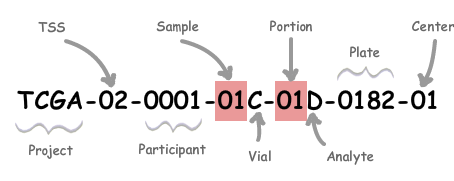

In this lesson we will explore some approaches to perform the discovery of 
molecular disease subtypes using multi-omics data. The identification
of disease subtypes has the goal to find homogeneous groups of patients 
that have similar clinical and/or molecular characteristics. Finding these 
groups of individuals may help to better predict their prognosis (i.e. 
patient's future health status) and better define the therapy that is more 
appropriate for the considered individual. This is an integral part of what is
known as "personalized medicine", i.e. the effort to tailor medicine taking into 
account genomics, environmental and lifestyle variables describing people. Moreover,
the detection of homogeneous groups of patients supported by molecular data can be
exploited to pinpoint causal biological pathways^[A pathway can be defined as a series of interactions among molecules in a cell that lead to a specific product or a change
in the cell @BiologicalPathways] that can be targeted by
drugs @saria2015subtyping. 
In particular, we will use a multi-omics dataset composed of breast cancer samples 
and we will attempt to find patients' groups through the integration of different
biological data sources and the application of state-of-the-art clustering approaches. 
The integration of multi-omics data will be performed using a popular graph-based 
integration algorithm called Similarity Network Fusion (SNF) @wang2014similarity, while we will perform clustering on the obtained network by Partitioning Around Medoids (PAM) @PAM. 
Then, we will see if the clustering we computed is aligned with a common 
subtyping for breast cancer based on gene expression
data of 50-genes (known as PAM50 @parker2009PAM50).


# Install and load packages

First of all, we need to install all the packages needed for this lesson 
(it will take a while):

```{r}
if (!require("BiocManager", quietly = TRUE))
    install.packages("BiocManager")

BiocManager::install("curatedTCGAData");
BiocManager::install("TCGAutils");
BiocManager::install("TCGAbiolinks");

install.packages("SNFtool");
install.packages("NetPreProc");
install.packages("caret");
install.packages("cluster");
install.packages("mclustcomp");
```

Now we can load the packages:

```{r message=FALSE, warning=FALSE}
library("curatedTCGAData");
library("TCGAbiolinks");
library("TCGAutils");
library("SNFtool");
library("NetPreProc");
library("caret");
library("cluster"); #pam
library("mclustcomp");
```

# What are multi-omics data?

As above-mentioned, we will download **multi-omics** data from patients having
breast cancer. A multi-omics dataset is a dataset comprising multiple different
biological data sources (i.e. messenger RNA, micro-RNA, proteins, genomic mutations, 
etc.), where each source represents a different data modality
capturing the state of a specific biological layer in the cells. The underlying 
idea of using multiple data sources is that a biological system (normal or
pathological) is the result of the interplay of multiple different molecules, thus 
considering many biological data sources at the same time gives us a more accurate
picture of underlying processes.

The advent of the so-called "high-throughput technologies" enables the 
evaluation of:

* Gen**ome**: the complete genetic information of an organism (i.e. the sequence
of nucleotides in the DNA)
* Transcript**ome**: set of all RNA transcripts (used also for all mRNA)
* Prote**ome**. entire set of proteins
* etc.

in cell, tissue, or organism at a certain time. We can see that the suffix -ome 
it is used with the meaning of whole/entire. All omics data are high-dimensional 
and characterized by "small-n large-p" (i.e. few samples and a large number of 
features) @momeni2020survey, which easily leads to the "curse of
dimensionality" in machine learning applications @venkat2018curse. 

<center>
)](./images/multi-omics.jpg){}
</center>

# Breast cancer multi-omics dataset

We download a breast cancer multi-omics dataset from
The Cancer Genome Atlas (TCGA) program @hutter2018TCGA. TCGA is a genomics
program that collected more than 11,000 cases across 33 tumor types, comprising 
multiple biological data sources (mRNA expression, miRNA expression, 
copy number values, DNA methylation, protein expression).
In particular, we exploit the package "curatedTCGAData" @ramos2020curatedTCGAData 
to download the following data views:

* mRNA data
* miRNA data
* protein data

The complete list of data types is available in the help page of the function
*?curatedTCGAData*.

```{r message=TRUE}
# Download breast cancer multi-omics dataset
# Note that RPPA stands for Reverse-phase protein array and it is 
# the technology used to obtain proteomic data. RNASeq stands for RNA-Sequencing
# and it is the technology used to measure mRNA and miRNA expression.
# Use ?curatedTCGAData to access the help page of the function and see
# the table with all the available data types (not all types are available for
# each cancer).
assays <- c("miRNASeqGene", "RNASeq2Gene", "RPPAArray");
mo <- curatedTCGAData(diseaseCode = "BRCA", 
                        assays = assays, 
                        version = "2.0.1", dry.run = FALSE);
```

Now we can print a simple summary of the object returned:

```{r message=TRUE}
# Print summary of mo:
mo;
```

As we can see, we obtain a MultiAssayExperiment object.

## What is a MultiAssayExperiment object?

In its essence, it is a data structure designed to store and coordinately 
analyze multi-omics experiments. In a way, it can be seen as an extension of 
the ExpressionSet class (see lesson 1) for more than one omic.
The three main components of this data structure are:

* colData: it contains a dataframe having for each sample the corresponding 
phenotipic characteristics (in our case mainly clinical data) - access **colData()**
* ExperimentList: a list with the considered experiments (i.e. data modalities
acquired with a specific technology). Elements of the list are usually matrices 
or dataframes - access **experiments()**
* sampleMap: it is a map that connects all the considered elements.- access **sampleMap()**

Moreover, a function is provided to build MultiAssayExperiment objects for your 
own data and also subsetting operations for coordinated data selection among views 
@ramos2017MultiAssayExperiment.

<center>
)](./images/multiassayexperiment.png)
</center>

# Data pre-processing
To work with data coming from TCGA, it is important to understand the structure of 
the barcode associated to each sample. Each sample/patient is identified by a barcode 
with a specific structure:

<center>
{width=70%}
</center>


You can find the details about each part of the barcode [here](https://docs.gdc.cancer.gov/Encyclopedia/pages/TCGA_Barcode/). 
In practice, the first 12 characters of the barcode (i.e. Project-TSS-Participant) 
identify a specific individual, while the other parts give us indications about 
the type of sample (i.e. primary, metastatic, solid, blood derived, etc.), the type of
genomic material extracted (i.e. DNA, RNA) and other information related to technical
replicates (i.e. repeated measurements from the same sample). If you are wondering 
about the difference between biological and technical replicates, look at this short
[video](https://www.youtube.com/watch?v=c_cpl5YsBV8).


We use the barcode to: 

* Retain only Primary Solid Tumors (i.e. the original tumor, not metastases, 
composing an abnormal mass), to have a more homogeneous group of samples. 
In TCGA "Primary Solid Tumors" are identified by the code "01" in the sample part 
of the barcode ( [here](https://gdc.cancer.gov/resources-tcga-users/tcga-code-tables/sample-type-codes) the list with all sample types code).
* Check for the presence of technical replicates in the dataset. If two samples have
the same 12 characters in their barcodes, then they come from the same patient and
can be identified as technical replicated (since we already filtered for the 
same sample type).

```{r message=FALSE, warning=FALSE}
# Consider only primary solid tumors:
primary <- TCGAutils::TCGAsampleSelect(colnames(mo), c("01"));
mo <- mo[, primary, ];

# Check for replicates (anyReplicated checks the so called biological or 
# primary unit in the sampleMap of the MultiAssayExperiment object, that
# corresponds to the first 12 characters of the barcodes for TCGA data):
check_rep <- anyReplicated(mo);
print(check_rep);

```
Then, other additional pre-processing steps are performed:

* Remove FFPE (formalin-fixed, paraffin-embedded) samples. Broadly speaking,
after a biopsy is performed we need to store and preserve the sample. Two major 
tissue preparation methods are generally used: (1) FFPE, (2) freezing the sample
(see this [link](https://www.biochain.com/blog/ffpe-vs-frozen-tissue-samples/) to
know more about the two methodologies). DNA and RNA molecules are preserved better
if the tissue is frozen, thus we will remove samples preserved using FFPE technique.

* Restrict samples to the ones having all the considered omics and extract the set
of omics (one matrix for each omic) in a list.

* Transpose each matrix to have samples in the rows and features in columns.

```{r}
# The information regarding if the sample is FFPE is stored in the clinical data,
# which are accessible using colData(). 
no_ffpe <- which(as.data.frame(colData(mo))$patient.samples.sample.is_ffpe == "no");
mo <- mo[, no_ffpe, ];

# Obtain samples having all the considered omics:
complete <- intersectColumns(mo);

# Extract assays in list:
complete <- assays(complete);

# Obtain matrices samples x features:
complete <- lapply(complete, FUN=t)

```

* Remove features having missing values (i.e. NA). In this case it is easier to
remove features instead of performing imputation, since only few features in the
proteomics data have missing values.

* Select features having more variance across samples. Here we make a strong
assumption: features that have more variance across samples bring more information
and are the more relevant ones. This feature selection strategy is fast and
commonly used in literature, however it as some drawbacks: (1) it is univariate,
thus does not considers interactions among features and (2) it is not able to remove 
redundant variables. Moreover, we need to identify a threshold for 
feature selection (top 500 features) but it is always an arbitrary choice. 

* Standardize features using z-score.

* Clean barcodes to retain only the first part specific for each individual.

```{r message=TRUE}
# Remove features having NAs (present only in proteomics data):
complete[[3]] <- complete[[3]][, colSums(is.na(complete[[3]])) == 0];

# Remove features with near zero variance and retain top 500 features 
# having higher variance:
nf <- 500;
for(i in 1:length(complete)){
    
    idx <- caret::nearZeroVar(complete[[i]])
    message(paste("Removed ", length(idx), "features from", names(complete)[i]));
    if(length(idx) != 0){
        complete[[i]] <- complete[[i]][, -idx];
    }

    if(ncol(complete[[i]]) <= nf) next
    
    vars <- apply(complete[[i]], 2, var);
    idx <- sort(vars, index.return=TRUE, decreasing = TRUE)$ix;
    
    complete[[i]] <- complete[[i]][, idx[1:nf]];
    
}

# Perform features standardization using z-score:
zscore <- function(data){
    
    zscore_vec <- function(x) { return ((x - mean(x)) / sd(x))}
    data <- apply(data, 2, zscore_vec)
    
    
    return(data)
}

complete <- lapply(complete, zscore);

# Clean barcodes retaining only "Project-TSS-Participant":
for(v in 1:length(complete)){
    rownames(complete[[v]]) <- substr(rownames(complete[[v]]), 1, 12);
}
```

# Multi-omics data integration

The integration of different omics data is an open problem in scientific 
literature and many methods were actually proposed to tackle this issue. 
A plethora of reviews about these approaches was written (an interested 
reader could start from our review work @gliozzo2022heterogeneous, which
is dedicated to method for the integration of Patient Similarity Networks but
provides a section - Appendix A - where all the main reviews about this topic 
are schematized).

To fuse our breast cancer multi-omic dataset, we will use a state-of-the-art 
approach called Similarity Network Fusion (SNF) @wang2014similarity, implemented
in the CRAN package SNFtool.
The first step in the SNF algorithm is the construction of a similarity matrix
among samples for each data source $s$. The similarity measure exploited is the 
*scaled exponential euclidean distance* (the same we used in lesson 1):

\begin{equation}
    \label{eq:scaled_exponential_sim}
    W^{(s)}(i,j) = exp \left(- \frac{\rho(x_i,x_j)^2}{\mu \varepsilon_{ij}}\right)
\end{equation}

where:

* $\rho(x_i, x_j)$ is the  Euclidean  distance  between  patients \(x_i\) and \(x_j\)
* $\mu$ is a parameter.
* $\varepsilon_{i,j}$ is a scaling factor: $\varepsilon_{i,j} = \frac{mean(\rho(x_i, N_i)) + mean(\rho(x_j, N_j)) + \rho(x_i, x_j)}{3}$, where  \(mean(\rho(x_i, N_i))\) is the average value of the distances between \(x_i\) and each of its neighbors.  

Then, other two matrices are derived from $W^{(s)}(i,j)$. One is a "global" similarity
matrix $P^{(s)}$ which is needed to capture the overall relationships between patients:

\begin{equation}
\label{eq:global_kernel}
    P^{(s)}(i,j) = 
    \begin{cases}
      \frac{W^{(s)}(i,j)}{2 \sum_{k \neq i} W^{(s)}(i,k)} & \text{, if $j \neq i$}\\
      1/2 & , \text{if $j = i$}\\
    \end{cases}       
\end{equation}

For this equation the property $\sum_{j} P(i,j)=1$ holds.

The other one is a "local" similarity matrix $S^{(s)}$, that captures the local structure of the network because considers only local similarities in the neighborhood
of each individual, setting to zero all the others:

\begin{equation}
\label{eq:local_kernel}
    S^{(s)}(i,j) = 
    \begin{cases}
      \frac{W^{(s)}(i,j)}{\sum_{k \in N_i} W^{(s)}(i,k)} & \text{, if $j \in N_i$}\\
      0 & , \text{otherwise}\\
    \end{cases}       
\end{equation}

where $N_i = \{ x_k | x_k \in kNN(x_i) \cup \{ x_i \}\}$.

Given $s$ data modalities, $s$ different $W$, $S$ and $P$ matrices are constructed 
and an iterative process is applied where similarities are diffused through the $P$s 
until convergence, that is, until all the matrices $P$ become similar.  
In the simplest case, when $s=2$, we have $P_t^{(s)}$ that refers to $P$ matrices for 
data $s \in \{ 1,2\}$ at time $t$.
In this case, the following recursive updating formulas describes the diffusion process:

\begin{equation}
    \label{eq:update}
    \begin{aligned}
        P^{(1)}_{t+1}=S^{(1)} \times P^{(2)}_{t} \times S^{(1)\top} \\
        P^{(2)}_{t+1}=S^{(2)} \times P^{(1)}_{t} \times  S^{(2)\top}  
    \end{aligned}
\end{equation}

In other words $P^{(1)}$ is updated by using $S^{(1)}$ from the same data source 
but $P^{(2)}$ from a different view and vice-versa.

SNF can be easily extended to $s > 2$ data sources. The final integrated matrix
$P^{(c)}$ is computed by averaging:

\begin{equation}
    \label{eq:consensus}
    P^{(c)} = \frac{1}{s} \sum_{k=1}^{s} P^{(k)}
\end{equation}

Now that the theory behind SNF is clear, let's apply the method to our dataset:

```{r}
# Compute similarity matrix for each data source using the scaled
# exponential euclidean distance:
W_list <- list();
for(i in 1:length(complete)){
    Dist <- (dist2(as.matrix(complete[[i]]), as.matrix(complete[[i]])))^(1/2);
    W_list[[i]] <- affinityMatrix(Dist);
}
    
# Integration of multi-omics data using Similarity Network Fusion:
# t is the number of iterations and K is the number of neighbors to 
# consider to compute the local similarity matrix:
W_int <- SNF(W_list, K=20, t=20);

```

# Breast cancer disease subtypes

Breast cancer can be divided into different subtypes (commonly Luminal A, Luminal B, 
HER2-Enriched, Basal-like and Normal-like), which are called "intrinsic subtypes" 
and are based on gene expression. The classification of a sample to a specific disease subtype helps to predict patients' prognosis and it has an impact also on the definition of the therapy. 
A schematic view of the breast cancer molecular subtypes can be
found [here](https://www.breastcancer.org/types/molecular-subtypes).
Many different tests to define the disease
subtype of a breast cancer patient are available, which consider different subset
of genes for the definition of the subtypes @schettini2022perspective.
TCGA provides the subtypes defined using the PAM50 model, which considers
the expression of a minimal set of 50 genes @parker2009PAM50.
We will try to see if the clusters we compute are similar to the PAM50 disease
subtypes provided by TCGA for breast cancer.

```{r}
# Download disease subtypes from TCGAbiolinks:
subtypes <- as.data.frame(TCGAbiolinks::PanCancerAtlas_subtypes());
subtypes <- subtypes[subtypes$cancer.type == "BRCA", ];

# Retain only primary solid tumors and select samples in common with omics data
# (in the same order):
subtypes <- subtypes[TCGAutils::TCGAsampleSelect(subtypes$pan.samplesID, "01"), ];
sub_select <- substr(subtypes$pan.samplesID,1,12) %in% rownames(complete[[1]]);
subtypes <- subtypes[sub_select, ];
rownames(subtypes) <- substr(subtypes$pan.samplesID, 1, 12);
subtypes <- subtypes[rownames(complete[[1]]),];

# Print number of samples for each subtype:
table(subtypes$Subtype_Selected);
```

# Disease subtype discovery by clustering approaches

We will attempt to identify disease subtypes using the **Partitioning Around Medoids** 
(PAM) clustering algorithm @PAM. The algorithm find a fixed number of clusters 
$k$ (given as input by the user) that are represented by their central points 
called *medoids*. The entire set of objects is $O$ and the set of objects that are
tentatively defined as medoids is $S$, so $U = O - S$ is the set of unselected objects.
The final goal is to obtain a set of clusters where the average distances of objects 
belonging to the cluster and the cluster representative is minimized 
(equivalently the sum of the distances can be minimized). In particular,
the algorithm has two phases:

* BUILD PHASE: the goal is to select $k$ initial objects to populate the set of selected objects $S$.
Then, the other objects in $U$ are assigned to the closest representative in $S$. 
The first object in $S$ is the one that has minimal distance with all the other objects, 
thus the most central data point. The other points $i$ in $U$ are evaluated to be selected
as representatives and chosen if they have a high number of unselected objects $j$ 
that are closer to $i$ than to already selected representatives belonging to $S$.
These steps are performed until a number of selected medoids $k$ is reached.

* SWAP PHASE: this phase is intended to improve the set of selected representatives.
For each pair of representative $i \in S$ and non-representative $h \in U$:
    * We swap $i$ and $h$, as that $h$ is a representative and $i$ is not.
    * Compute the contribution $K_{jih}$ of each object $j \in U - \{h\}$ to the swap
    of $i$ and $h$. We can have two main situations:
        1. $d(j, i) > D_{j}$, where $D_{j}$ is the dissimilarity between $j$ 
        and the closest object in $S$. Then, $K_{jih} = min\{d(j,h) - D_{j}, 0\}$.
        2. $d(j, i) = D_{j}$. Then, $K_{jih} = min\{d(j,h), E_{j}\} - D_{j}$, 
        where $E_{j}$ is the dissimilarity between $j$ and the second closest object in $S$.
    * Compute the total results of the swap as $T_{ih} = \sum\{ K_{jih} | j \in U\}$.
    * Select the pair $i, h$ that minimizes $T_{ih}$.
    * If $T_{ih} < 0$ the swap is performed, $D_{j}$ and $E_{j}$ are recomputed 
    and we return at the first step of the SWAP phase. Otherwise, the algorithm stops 
    if all $T_{ih} > 0$.
 
Let's apply the PAM algorithm to our integrated similarity matrix (which we convert
into a distance matrix). Note that we set the number of clusters to the number of
breast cancer molecular disease subtypes.

```{r}
# Convert similarity matrix into a distance matrix. The similarities
# are normalized in the range [0, 1] using min-max normalization before
# conversion into distances.
dist <- 1 - NetPreProc::Max.Min.norm(W_int);
D <- as.dist(dist); 
# you can pass to pam a dist object (created using as.dist()
# on the distance matrix) or directly the matrix. In this last 
# case, set diss=TRUE in pam. See ?pam for further details.
                

# Apply clustering algorithms on integrated matrix:
k <- length(unique(subtypes$Subtype_Selected));
pam.res <- pam(D, k=k);
```

# Compare PAM clustering with molecular disease subtypes

Now, we want to compare the computed clustering with the disease subtypes we 
already have. Many measures to compare clusters actually exists @wagner2007comparing, 
indeed the R package we use (mclustcomp) already implements 24 different scores. 
We will compute three of the most used measures to compare clusters:

* *Rand Index (RI)*: this index is one of the measures based on "counting pairs" of 
objects that are in the same cluster in both clusterings $C_1$ and $C_2$. 
It just counts the number of objects pairs that are in the same clusters both in 
$C_1$ and $C_2$ (defined by $n_{11}$) and the number of pairs that are in different 
clusters both in $C_1$ and $C_2$ (defined by $n_{00}$) w.r.t. all the possible 
pairs:
\begin{equation}
  R(C_1, C_2) = \frac{2(n_{11} + n_{00})}{n(n-1)}
\end{equation}
  Rand index ranges from 0 to 1, where 1 indicates identical clusterings and 0 
completely different clusterings.

* *Adjusted Rand Index (ARI)*: If we consider two random partitions of a dataset, 
the Rand index does not assume a constant value (e.g. 0). Thus, the ARI is the
RI corrected-for-chance, that assumes a generalized hypergeometric distribution as
null hypothesis. ARI is the (normalized) difference of the RI and its expected
value under the null hypothesis. 
ARI ranges from $-0.5$ to 1, where 1 indicates identical clusterings and near zero values independent clusterings.

* *Normalized Mutual Information (NMI)*: the mutual information is a way to quantify
how much we can reduce uncertainty about the cluster of an element when we already know
its cluster in another clustering:
\begin{equation}
  MI(C_1, C_2) = \sum_{i=1}^{k} \sum_{j=1}^{l} P(i,j) log_{2} \frac{P(i,j)}{P(i)P(j)}
\end{equation}
where $P(i,j)= \frac{|C_{1i} \cap C_{2j}|}{n}$ is the probability that an element belongs 
to cluster $C_i \in C_1$ and cluster $C_j \in C_2$.
Mutual information is not upper bounded, thus its interpretability is difficult.
A normalized version of the mutual information is:
\begin{equation}
  NMI(C_1, C_2) = \frac{MI(C_1, C_2)}{\sqrt{H(C_1) H(C_2)}}
\end{equation}
where $H(C_1)$ and $H(C_2)$ are the entropies associated to clusterings $C_1$ and $C_2$.
NMI ranges between 0 and 1, where maximum NMI is reached if $C_1=C_2$.

We can now compute the considered measures to compare PAM clustering and 
molecular disease subtypes:

```{r}
# Covert disease subtypes to numeric vector:
labels <- as.numeric(factor(subtypes$Subtype_Selected, levels=unique(subtypes$Subtype_Selected)));

# Compute measures:
types <- c("rand", "adjrand", "nmi1");
metrics.pam <- mclustcomp(pam.res$clustering, labels, types=types);

# Print results:
as.data.frame(metrics.pam);
```

The above table shows that the two clusterings have some overlap even if it is limited.
We can immediately spot that the Rand Index gives more optimistic results, thus to have
a fair interpretation of the results is always better to consider different measures 
(both based on counting pairs and information theory).
The limited overlap between molecular disease subtypes based on PAM50 and our clustering is expected. First of all, PAM50 is based only on mRNA data from 50 genes while our clustering derives from a multi-omics integration of three different data sources.
This means that we have more information to exploit in the clustering which can lead
to clusters with a different biological meaning.
Second, it is possible that our trivial feature selection based on variance has actually removed that pool of 50 genes from our dataset, thus making more 
difficult the identification of the subgroups based on other features.


# Session Info
```{r}
sessionInfo();
```

# References
<div id="refs"></div>


